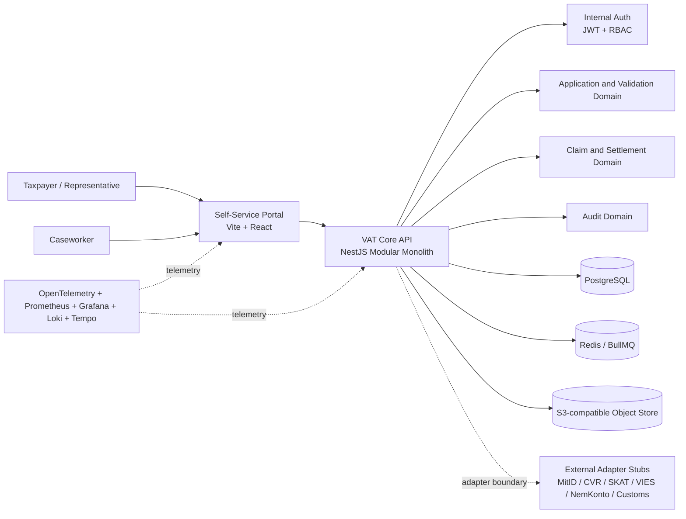

# 01 Overview: VAT Core System Context (MVP)

```mermaid
flowchart LR
  U[Taxpayer / Representative] --> FE[Self-Service Portal\nVite + React]
  CW[Caseworker] --> FE

  FE --> API[VAT Core API\nNestJS Modular Monolith]

  API --> AUTH[Internal Auth\nJWT + RBAC]
  API --> APP[Application and Validation Domain]
  API --> CLAIM[Claim and Settlement Domain]
  API --> AUD[Audit Domain]

  API --> PG[(PostgreSQL)]
  API --> REDIS[(Redis / BullMQ)]
  API --> OBJ[(S3-compatible Object Store)]

  API -. adapter boundary .-> STUBS[External Adapter Stubs\nMitID / CVR / SKAT / VIES / NemKonto / Customs]

  OBS[OpenTelemetry + Prometheus + Grafana + Loki + Tempo] -. telemetry .-> API
  OBS -. telemetry .-> FE
```
