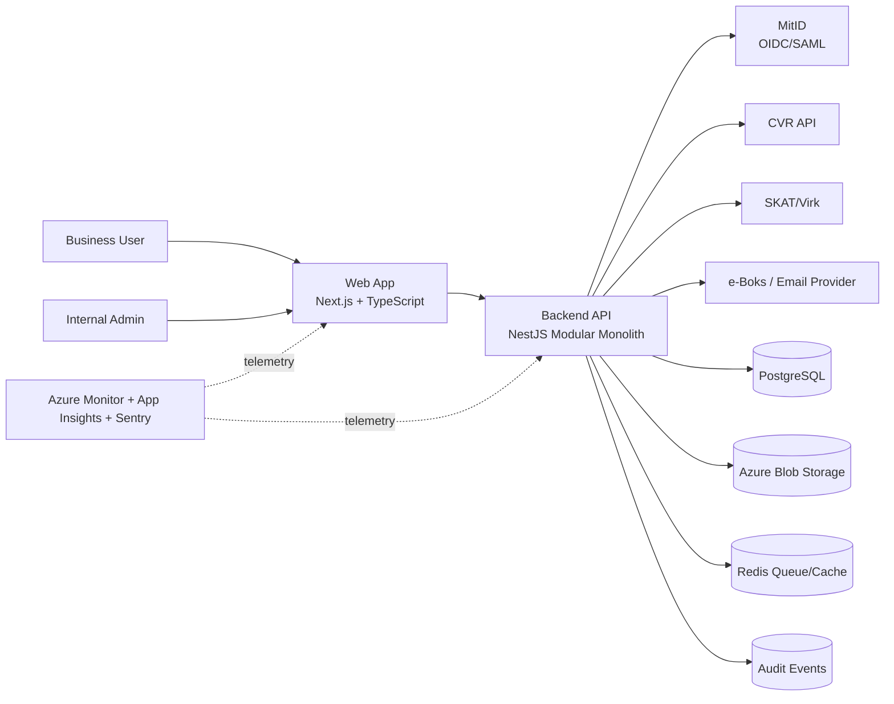

# System Context Diagram

```mermaid
flowchart LR
  U[Business User] --> FE[Web App\nNext.js + TypeScript]
  ADM[Internal Admin] --> FE

  FE --> API[Backend API\nNestJS Modular Monolith]

  API --> MITID[MitID\nOIDC/SAML]
  API --> CVR[CVR API]
  API --> SKAT[SKAT/Virk]
  API --> NOTIF[e-Boks / Email Provider]

  API --> PG[(PostgreSQL)]
  API --> BLOB[(Azure Blob Storage)]
  API --> REDIS[(Redis Queue/Cache)]
  API --> AUDIT[(Audit Events)]

  OBS[Azure Monitor + App Insights + Sentry] -. telemetry .-> API
  OBS -. telemetry .-> FE
```
