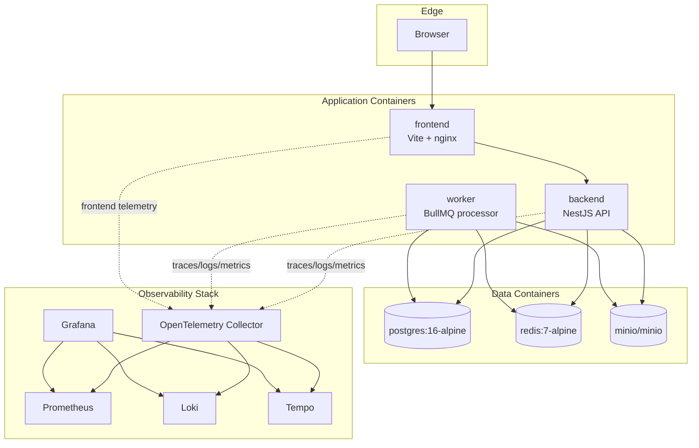

# 02 Drill-Down: Runtime Container Topology (Docker MVP)

```mermaid
flowchart TB
  subgraph EDGE[Edge]
    BROWSER[Browser]
  end

  subgraph APP[Application Containers]
    FE[frontend\nVite + nginx]
    API[backend\nNestJS API]
    WK[worker\nBullMQ processor]
  end

  subgraph DATA[Data Containers]
    PG[(postgres:16-alpine)]
    REDIS[(redis:7-alpine)]
    MINIO[(minio/minio)]
  end

  subgraph OBS[Observability Stack]
    OTEL[OpenTelemetry Collector]
    PROM[Prometheus]
    GRAF[Grafana]
    LOKI[Loki]
    TEMPO[Tempo]
  end

  BROWSER --> FE
  FE --> API
  API --> PG
  API --> REDIS
  API --> MINIO
  WK --> REDIS
  WK --> PG
  WK --> MINIO

  API -. traces/logs/metrics .-> OTEL
  WK -. traces/logs/metrics .-> OTEL
  FE -. frontend telemetry .-> OTEL
  OTEL --> PROM
  OTEL --> LOKI
  OTEL --> TEMPO
  GRAF --> PROM
  GRAF --> LOKI
  GRAF --> TEMPO
```
