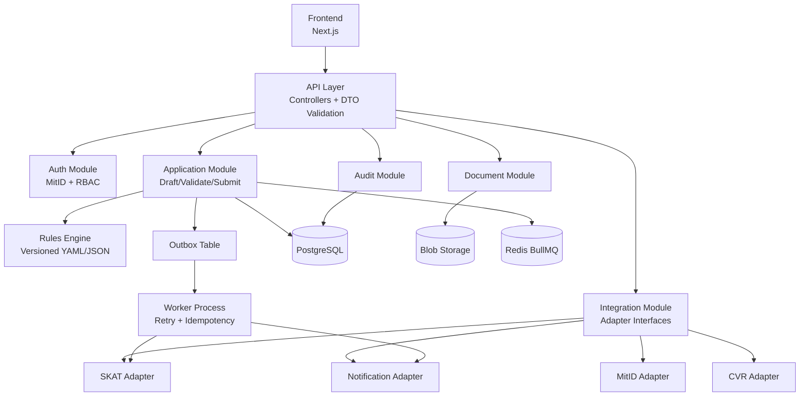

# Container Architecture Diagram

```mermaid
flowchart TB
  FE[Frontend\nNext.js] --> GATE[API Layer\nControllers + DTO Validation]
  GATE --> AUTH[Auth Module\nMitID + RBAC]
  GATE --> APP[Application Module\nDraft/Validate/Submit]
  GATE --> DOC[Document Module]
  GATE --> AUD[Audit Module]
  GATE --> INT[Integration Module\nAdapter Interfaces]

  APP --> RULES[Rules Engine\nVersioned YAML/JSON]
  APP --> OUTBOX[Outbox Table]

  INT --> MITID_A[MitID Adapter]
  INT --> CVR_A[CVR Adapter]
  INT --> SKAT_A[SKAT Adapter]
  INT --> MSG_A[Notification Adapter]

  APP --> PG[(PostgreSQL)]
  DOC --> BLOB[(Blob Storage)]
  APP --> REDIS[(Redis BullMQ)]
  AUD --> PG
  OUTBOX --> WORKER[Worker Process\nRetry + Idempotency]
  WORKER --> SKAT_A
  WORKER --> MSG_A
```
