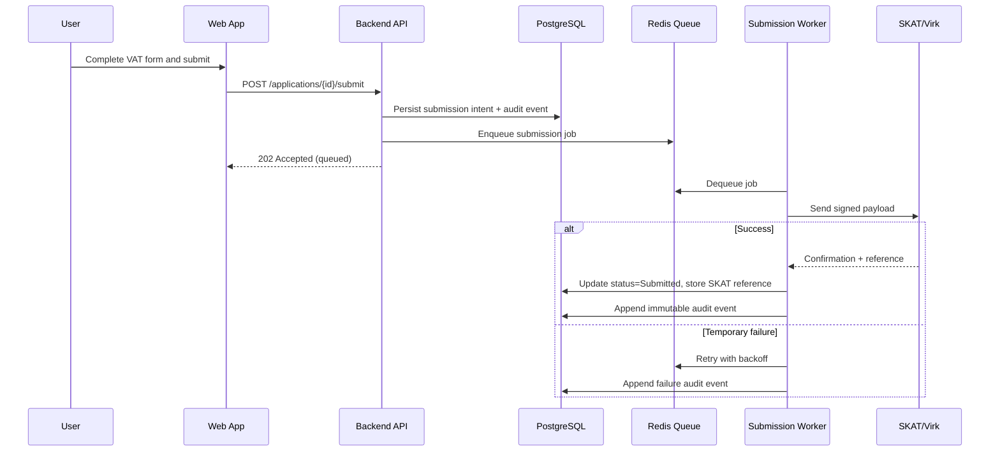

# Submission Sequence Diagram

```mermaid
sequenceDiagram
  participant User
  participant FE as Web App
  participant API as Backend API
  participant DB as PostgreSQL
  participant Q as Redis Queue
  participant W as Submission Worker
  participant SKAT as SKAT/Virk

  User->>FE: Complete VAT form and submit
  FE->>API: POST /applications/{id}/submit
  API->>DB: Persist submission intent + audit event
  API->>Q: Enqueue submission job
  API-->>FE: 202 Accepted (queued)

  W->>Q: Dequeue job
  W->>SKAT: Send signed payload
  alt Success
    SKAT-->>W: Confirmation + reference
    W->>DB: Update status=Submitted, store SKAT reference
    W->>DB: Append immutable audit event
  else Temporary failure
    W->>Q: Retry with backoff
    W->>DB: Append failure audit event
  end
```
