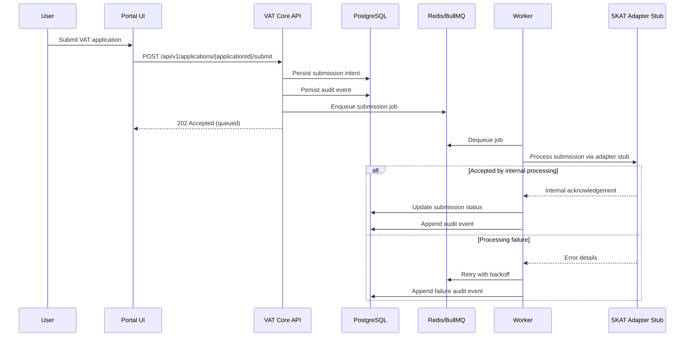

# 03 Drill-Down: Application Submission and Processing (MVP)

```mermaid
sequenceDiagram
  participant User
  participant FE as Portal UI
  participant API as VAT Core API
  participant DB as PostgreSQL
  participant Q as Redis/BullMQ
  participant W as Worker
  participant STUB as SKAT Adapter Stub

  User->>FE: Submit VAT application
  FE->>API: POST /api/v1/applications/{applicationId}/submit
  API->>DB: Persist submission intent
  API->>DB: Persist audit event
  API->>Q: Enqueue submission job
  API-->>FE: 202 Accepted (queued)

  W->>Q: Dequeue job
  W->>STUB: Process submission via adapter stub
  alt Accepted by internal processing
    STUB-->>W: Internal acknowledgement
    W->>DB: Update submission status
    W->>DB: Append audit event
  else Processing failure
    STUB-->>W: Error details
    W->>Q: Retry with backoff
    W->>DB: Append failure audit event
  end
```
