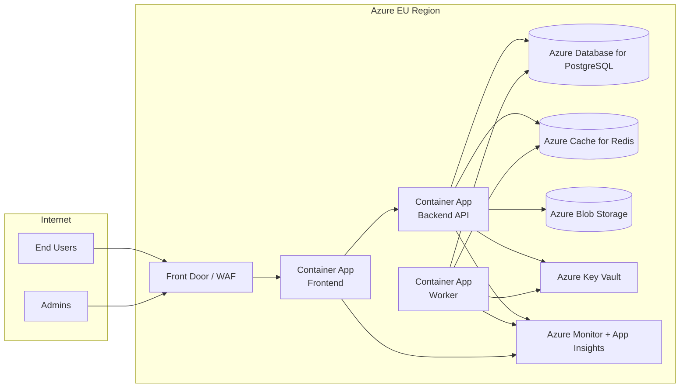

# Azure Deployment Diagram

```mermaid
flowchart LR
  subgraph Internet
    U[End Users]
    A[Admins]
  end

  subgraph Azure_EU[Azure EU Region]
    FD[Front Door / WAF]
    ACA1[Container App\nFrontend]
    ACA2[Container App\nBackend API]
    ACA3[Container App\nWorker]
    PG[(Azure Database for PostgreSQL)]
    RC[(Azure Cache for Redis)]
    BL[(Azure Blob Storage)]
    KV[Azure Key Vault]
    MON[Azure Monitor + App Insights]
  end

  U --> FD
  A --> FD
  FD --> ACA1
  ACA1 --> ACA2
  ACA2 --> PG
  ACA2 --> RC
  ACA2 --> BL
  ACA2 --> KV
  ACA3 --> RC
  ACA3 --> PG
  ACA3 --> KV
  ACA2 --> MON
  ACA3 --> MON
  ACA1 --> MON
```
