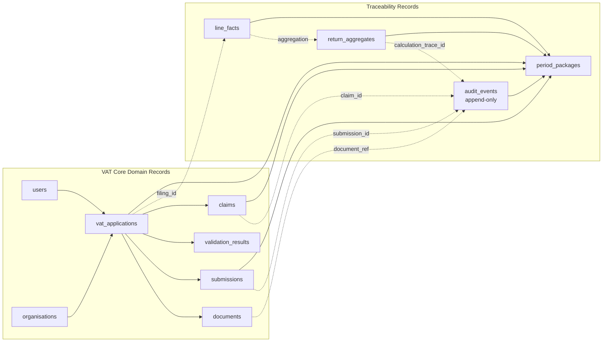

# 04 Drill-Down: Data and Audit Traceability Model

```mermaid
flowchart LR
  subgraph DOMAIN[VAT Core Domain Records]
    U[users]
    O[organisations]
    A[vat_applications]
    D[documents]
    S[submissions]
    C[claims]
    V[validation_results]
  end

  subgraph AUDIT[Traceability Records]
    E[audit_events\nappend-only]
    F[line_facts]
    R[return_aggregates]
    P[period_packages]
  end

  U --> A
  O --> A
  A --> D
  A --> S
  A --> V
  A --> C

  A -. filing_id .-> F
  F -. aggregation .-> R
  R -. calculation_trace_id .-> E
  S -. submission_id .-> E
  C -. claim_id .-> E
  D -. document_ref .-> E

  A --> P
  F --> P
  R --> P
  S --> P
  C --> P
  E --> P
```
