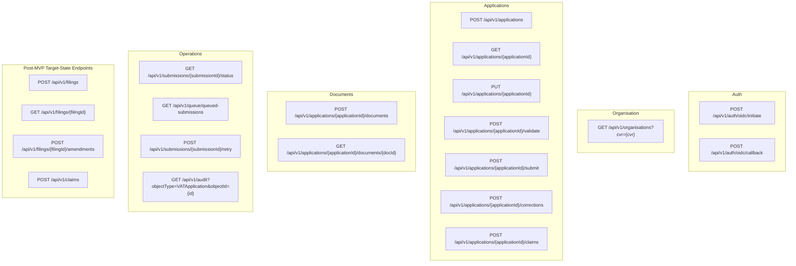

# 05 Drill-Down: API Surface by Capability

```mermaid
flowchart TB
  subgraph AUTH[Auth]
    A1["POST /api/v1/auth/oidc/initiate"]
    A2["POST /api/v1/auth/oidc/callback"]
  end

  subgraph ORG[Organisation]
    O1["GET /api/v1/organisations?cvr={cvr}"]
  end

  subgraph APPS[Applications]
    P1["POST /api/v1/applications"]
    P2["GET /api/v1/applications/{applicationId}"]
    P3["PUT /api/v1/applications/{applicationId}"]
    P4["POST /api/v1/applications/{applicationId}/validate"]
    P5["POST /api/v1/applications/{applicationId}/submit"]
    P6["POST /api/v1/applications/{applicationId}/corrections"]
    P7["POST /api/v1/applications/{applicationId}/claims"]
  end

  subgraph DOCS[Documents]
    D1["POST /api/v1/applications/{applicationId}/documents"]
    D2["GET /api/v1/applications/{applicationId}/documents/{docId}"]
  end

  subgraph OPS[Operations]
    S1["GET /api/v1/submissions/{submissionId}/status"]
    Q1["GET /api/v1/queue/queued-submissions"]
    Q2["POST /api/v1/submissions/{submissionId}/retry"]
    AU1["GET /api/v1/audit?objectType=VATApplication&objectId={id}"]
  end

  subgraph FUTURE[Post-MVP Target-State Endpoints]
    F1["POST /api/v1/filings"]
    F2["GET /api/v1/filings/{filingId}"]
    F3["POST /api/v1/filings/{filingId}/amendments"]
    F4["POST /api/v1/claims"]
  end
```
