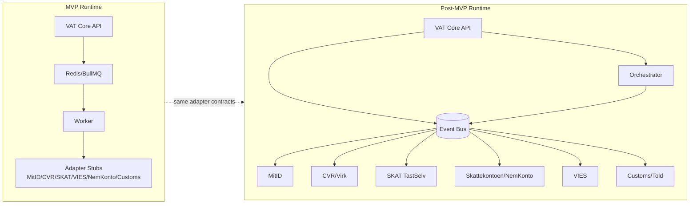

# 06 Drill-Down: MVP-to-Post-MVP Integration Evolution

This diagram shows how integration boundaries evolve from internal stubs in MVP to live connectors post-MVP.

```mermaid
flowchart LR
  subgraph MVP[MVP Runtime]
    API[VAT Core API]
    Q[Redis/BullMQ]
    W[Worker]
    STUB[Adapter Stubs\nMitID/CVR/SKAT/VIES/NemKonto/Customs]
    API --> Q --> W --> STUB
  end

  subgraph POST[Post-MVP Runtime]
    API2[VAT Core API]
    ORCH[Orchestrator]
    BUS[(Event Bus)]
    IDP[MitID]
    CVR[CVR/Virk]
    SKAT[SKAT TastSelv]
    PAY[Skattekontoen/NemKonto]
    EU[VIES]
    CUST[Customs/Told]
    API2 --> ORCH
    API2 --> BUS
    ORCH --> BUS
    BUS --> IDP
    BUS --> CVR
    BUS --> SKAT
    BUS --> PAY
    BUS --> EU
    BUS --> CUST
  end

  MVP -. same adapter contracts .-> POST
```
