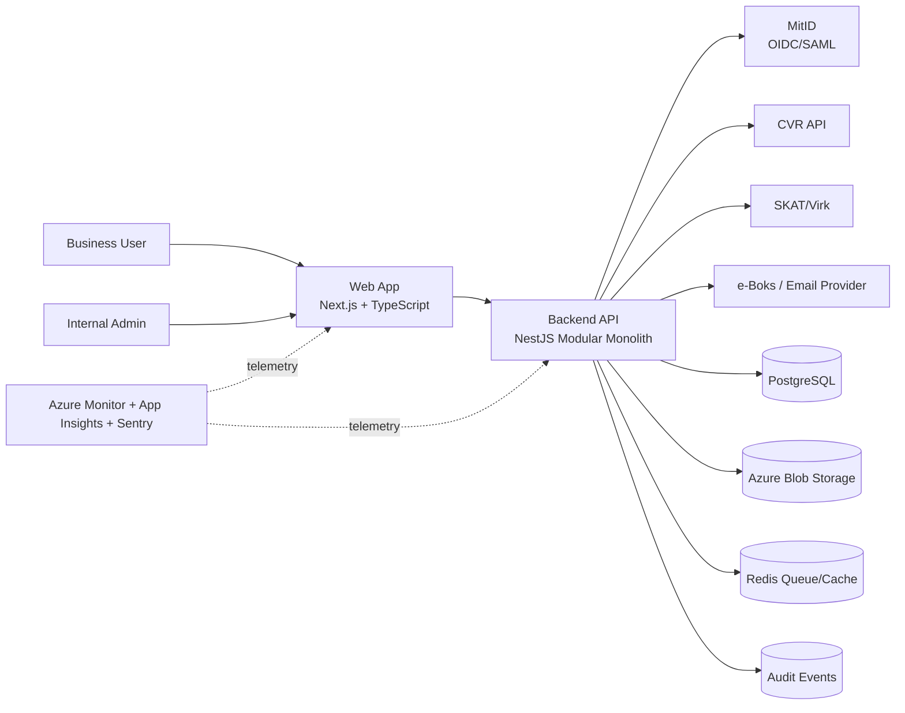
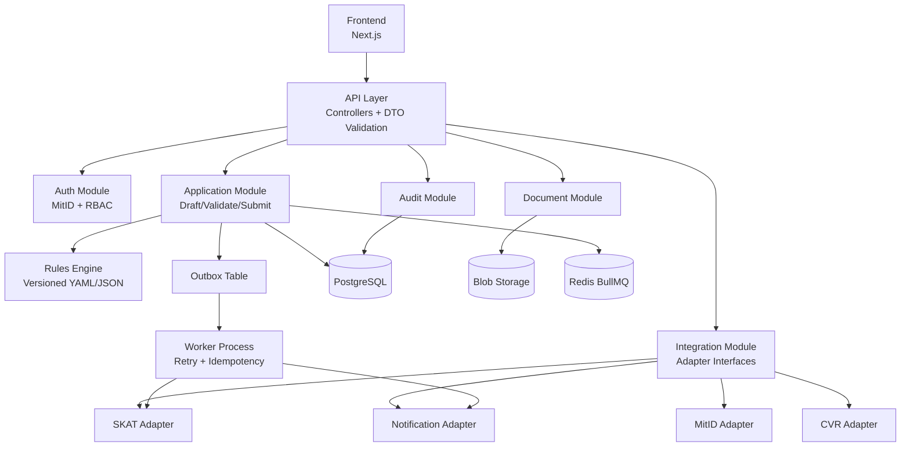
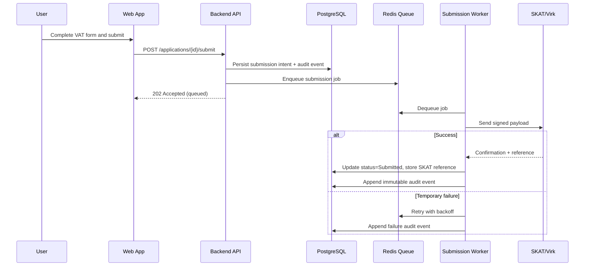
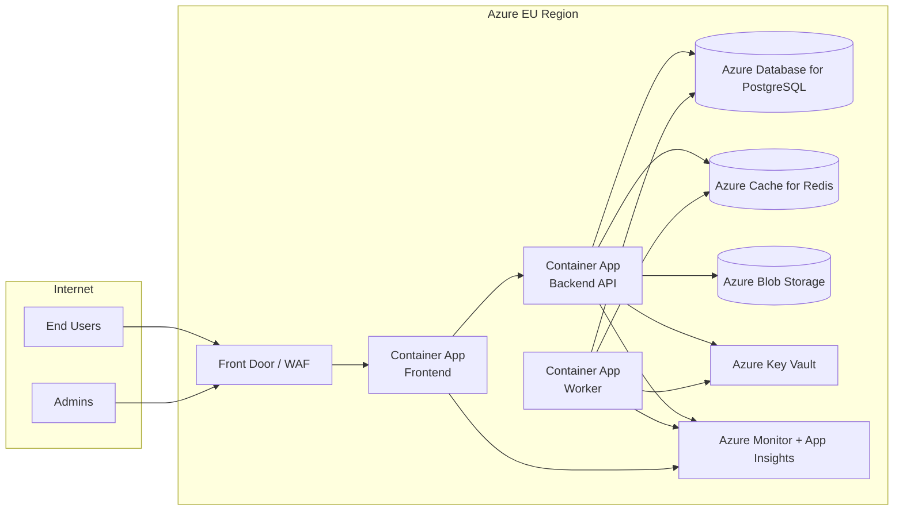

**System Outline — VAT Registration Platform**

Purpose
- A single, authoritative document describing system architecture, user journeys, API surface, data model, integrations, security, testing, and operational runbooks for the Danish VAT registration product.

Scope
- Covers core user flows: obligation assessment, application drafting, validation, submission to SKAT, corrections/claims, and auditing.
- Links to implementation artifacts: `architecture.md`, `openapi.yaml`, `db_schema.sql`, and `team.mcp.yaml`.

High-level overview
- Users authenticate with MitID, may prefill data from CVR, complete a short questionnaire to assess VAT obligation, fill and upload required documents, validate using the legal ruleset, then submit to SKAT (or produce signed payload/PDF for manual submission). The system tracks lifecycle and produces post-registration tasks.

User workflows (seven steps)
1. Assessment: call the obligation engine; receive decision and citations.
2. Identity & Organisation: MitID OIDC, CVR lookup, link accounts.
3. Draft Application: create/modify application; upload documents.
4. Validate: server-side legal ruleset run; present warnings/errors with citations.
5. Submit: queue or send to SKAT adapter; store submission payload and SKAT response.
6. Post-Submission: track status, handle follow-ups or info requests.
7. Post-Registration: produce compliance checklist and reminders.

Minimal API surface (summary)
- Auth: `POST /auth/oidc/initiate`, `GET /auth/oidc/callback` (MitID)
- Organisation: `GET /organisations?cvr={cvr}`
- Obligation: `POST /assess/obligation`
- Applications: `POST /applications`, `GET /applications/{id}`, `PUT /applications/{id}`
- Documents: `POST /applications/{id}/documents`, `GET /applications/{id}/documents/{docId}`
- Validation: `POST /applications/{id}/validate`, `GET /validation/rulesets`
- Assessment: `POST /applications/{id}/assess`
- Submissions: `POST /applications/{id}/submit`, `GET /submissions/{submissionId}/status`, `POST /integrations/skats/callback`
- Corrections & Claims: `POST /applications/{id}/corrections`, `POST /applications/{id}/claims`
- Audit: `GET /audit?objectType=VATApplication&objectId={id}`
- Admin: `GET /queue/queued-submissions`, `POST /submissions/{submissionId}/retry`

API documentation
- A starter OpenAPI definition lives in `openapi.yaml`. Use it to generate client/server stubs and keep the API contract authoritative.

Data model (key entities)
- `users` — MitID identity, email, display name.
- `organisations` — CVR, name, addresses, metadata.
- `vat_applications` — application_data JSONB, status, skat_reference, submission_payload.
- `documents` — blob storage references and metadata.
- `audit_events` — immutable event trail.
- See `db_schema.sql` for the initial PostgreSQL schema and indices.

Integrations & connectors
- MitID (OIDC/OpenID Connect) — authentication and identity proofing.
- CVR API — company metadata lookup and prefill.
- SKAT/Virk adapter — submission, status, webhooks. Confirm production sandbox endpoints and security with `researcher`.
- e-Boks / Email — deliver confirmations and notices.

Validation and legal rules
- `researcher` maintains a machine-readable ruleset (YAML/JSON) mapping UI inputs to legal citations and validation logic.
- Validation output must include citation keys so every decision can be traced to a law/guidance reference.

Security, privacy, and compliance
- Strong auth via MitID; RBAC for internal access.
- Encrypt PII at rest; TLS for transport.
- Store minimal necessary data; apply retention and purge policies per legal advice.
- Audit trail required for every state change and external submission.

Testing strategy
- Unit tests for validation and business logic.
- Integration tests with MitID (stubs), CVR, and SKAT adapter (sandbox/contract tests).
- E2E tests for registration happy path and key edge cases.
- Compliance tests that assert traceability to legal citations.

Observability & operations
- Health endpoints, metrics for queue depth and failed submissions, structured logs.
- Runbooks: MitID failures, submission retries, data breach process, retention purge, onboarding new ruleset versions.

Acceptance criteria
- Sandbox end-to-end submission works and returns a confirmation or queued status.
- All validation responses reference citation keys from the ruleset.
- PII encrypted and audit trail present.
- Reviewer and researcher sign-off for compliance-critical flows.

Responsibilities and files
- `researcher`: `researcher.md` — legal ruleset and `legal-scope.md` (to be created).
- `designer`: `designer.md` — wireframes and flows.
- `architect`: `architecture.md` — architecture note and decision rationale.
- `developer`: `openapi.yaml`, `db_schema.sql` — implementation artifacts and server stubs.
- `team.mcp.yaml` — overall roles, workflow, and decision rules.

Operational checklist (deployment)
- CI: lint, unit, contract, integration, E2E tests.
- Secrets: MitID client secrets, SKAT adapter certs stored in a vault.
- Infra: managed Postgres, blob storage (EU region), queue service.
- Backups, monitoring, and incident channels configured before production rollout.

Next immediate actions (recommended)
1. Create `legal-scope.md` stub for `researcher` to fill with SKAT submission requirements.
2. `designer` produce minimal wireframes for the seven user steps.
3. `developer` scaffold a minimal FastAPI server using `openapi.yaml` and migrations from `db_schema.sql`.

References (workspace files)
- `architecture.md` — architecture notes
- `openapi.yaml` — API contract
- `db_schema.sql` — initial schema
- `team.mcp.yaml` — roles & workflow

Contact & ownership
- Owner: `architect` (see `architect.md`).
- For legal questions and citations: `researcher`.

Document history
- Created: 2026-02-24
- Authors: architect (initial)

## Architecture Diagrams

### 1) System Context Diagram

### 2) Container Diagram (Application Internals)

### 3) Submission Sequence Diagram

### 4) Deployment Diagram (Azure)

### Diagram Notes
- The backend is a modular monolith with strict module boundaries and external adapters.
- Submission is asynchronous to absorb external API instability and support safe retries.
- Audit events are append-only and written on every critical state transition.
- Container Apps is the default runtime; migration path to AKS remains open if scale/ops needs change.
